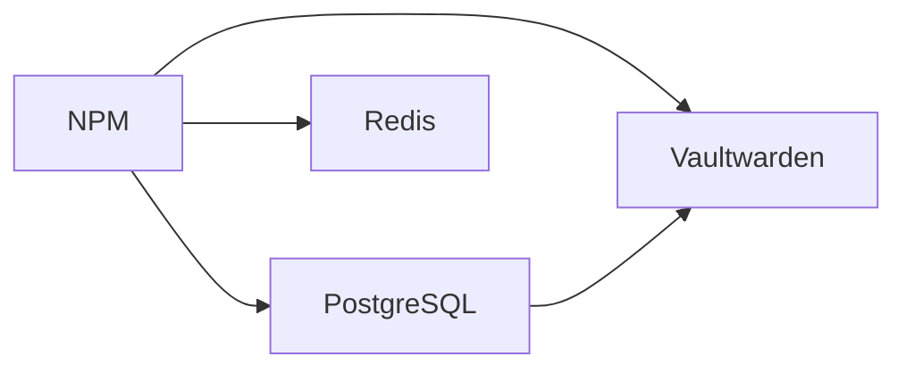
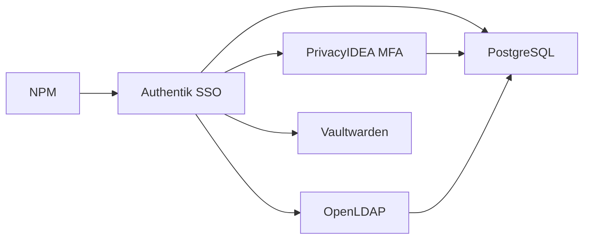
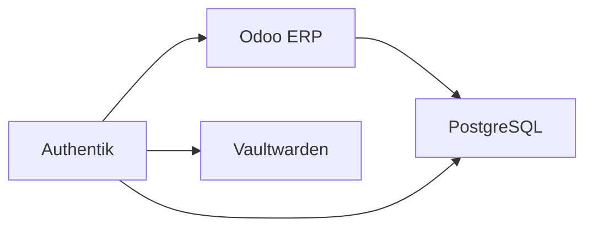
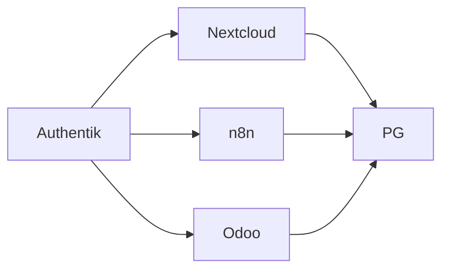
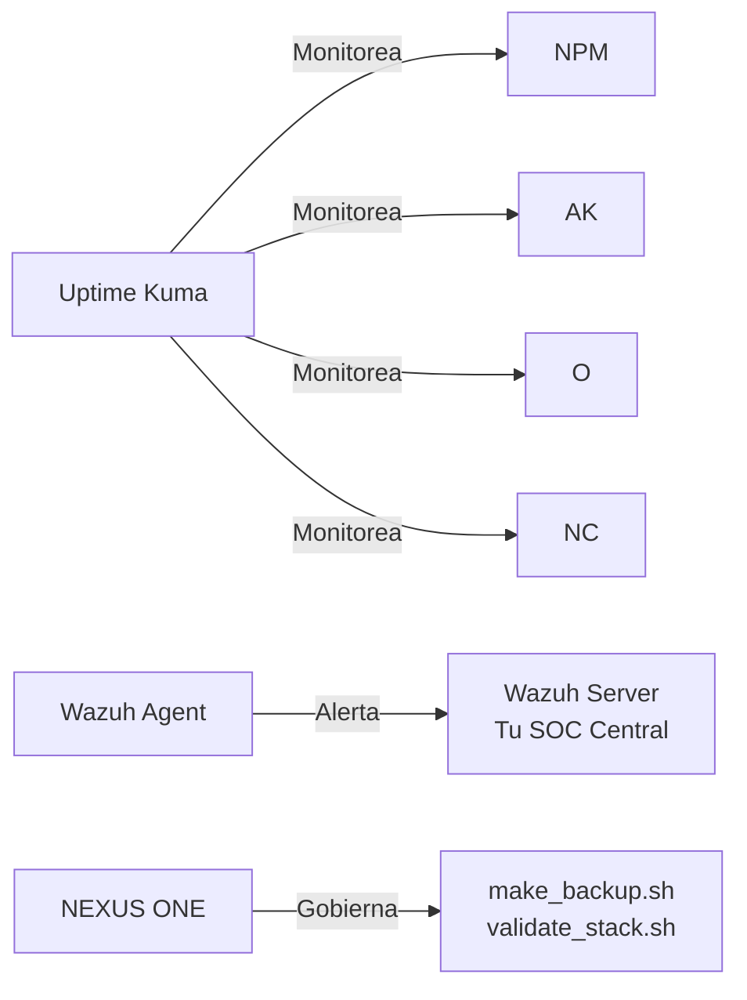

# Perfiles de Despliegue NEXUS CORE
# =================================================================

## Tabla Comparativa

| Perfil | RAM Min | Servicios | Caso de Uso |
|---|---|---|---|
| esencial | 2-4GB | NPM + PostgreSQL + Redis + Vaultwarden | Microempresa que solo quiere gestor de contrasenas seguro |
| esencial-plus | 4-6GB | + Authentik + PrivacyIDEA + OpenLDAP | Empresa que necesita SSO + MFA + directorio LDAP |
| intermedio | 6-8GB | + Odoo 18 CE | Empresa que necesita ERP con seguridad integrada |
| intermedio-plus | 8-12GB | + Nextcloud + n8n | Empresa que necesita cloud + automatización |
| avanzado | 12GB+ | + Uptime Kuma + Wazuh Agent + NEXUS ONE ready | Operaciones 24/7 con monitoreo y agente autonomo |

## Detalle por Perfil

### Esencial

- Ideal para: microempresas, oficinas, buffets
- Cobertura: gestion de contrasenas empresarial
- VPS recomendado: 2 vCPU, 4GB RAM ($10-15/mes)

### Esencial Plus

- Ideal para: empresas que necesitan cumplimiento y control de accesos
- Cobertura: SSO + 2FA + directorio de usuarios
- VPS recomendado: 2 vCPU, 6GB RAM ($15-20/mes)

### Intermedio

- Ideal para: empresas comerciales, distribuidoras, constructoras
- Cobertura: ERP completo con seguridad empresarial
- VPS recomendado: 4 vCPU, 8GB RAM ($20-30/mes)

### Intermedio Plus

- Ideal para: empresas con operaciones digitales y automatización
- Cobertura: cloud colaborativo + workflows automatizados
- VPS recomendado: 4 vCPU, 10GB RAM ($30-40/mes)

### Avanzado

- Ideal para: empresas 24/7, equipos TI, operaciones criticas
- Cobertura: monitoreo + EDR + agente autonomo
- VPS recomendado: 6 vCPU, 16GB RAM ($50-70/mes)

## Resumen de Recursos por Servicio

| Servicio | CPU Limite | RAM Limite |
|---|---|---|
| NPM | 0.30 | 200M |
| PostgreSQL | 1.0 | 1200M |
| Redis | 0.20 | 256M |
| OpenLDAP | 0.40 | 512M |
| Authentik Server | 0.60 | 512M |
| Authentik Worker | 0.40 | 256M |
| PrivacyIDEA | 0.70 | 800M |
| Odoo | 0.80 | 600M |
| Nextcloud | 0.60 | 400M |
| Vaultwarden | 0.20 | 64M |
| n8n | 0.40 | 200M |
| Uptime Kuma | 0.20 | 128M |

Total estimado (perfil avanzado): ~5.0 CPU, ~5GB RAM

#End Development By Angel Esquivel (CyberSecurity) [NEXUS CORE 2026]
